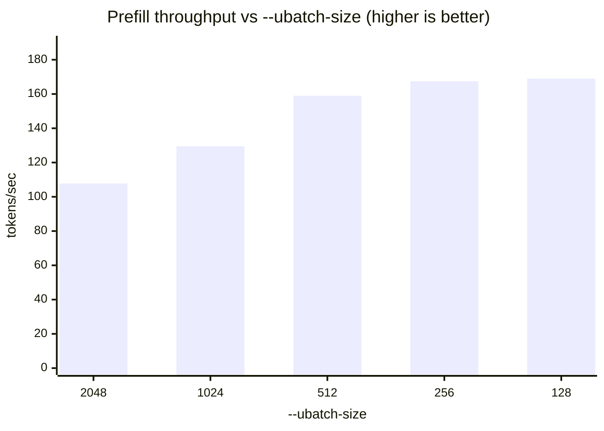
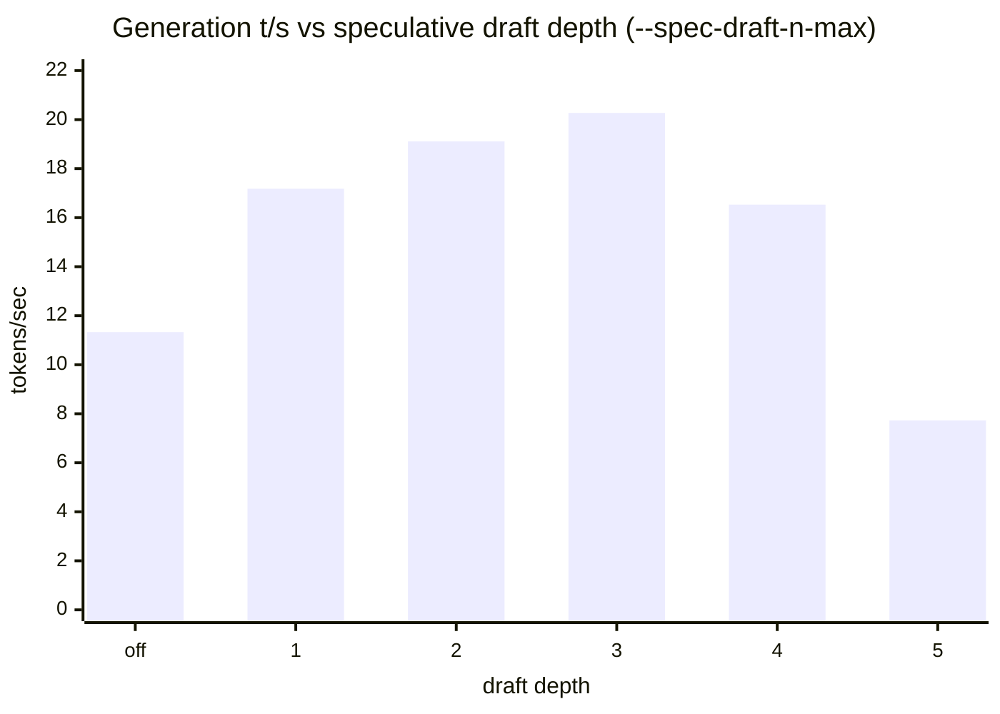

# Benchmarking on this box — what, how, and how to read it

Two different questions, two different tools. Do not mix them up:

| question | tool | unit |
|---|---|---|
| **How fast is it?** | `scripts\windows\bench-big.ps1`, `scripts\windows\bench-spec.ps1` | tokens/sec (pp and tg, separately) |
| **How good is it?** | `evals\run-guarded.ps1` | pass rate on private suites |

Speed is cheap to measure and easy to trust. Quality is expensive to measure and *very* easy to get
wrong — five separate harness bugs produced five believable-but-false quality numbers on
2026-08-03/04. Everything below exists because of that.

---

## 1. Speed

### What is measured

**Two numbers, never one.** A single "tok/s" is not a result:

- **pp (prompt processing / prefill)** — how fast it ingests your context. Compute-bound. This is
  what you wait on when an agent sends a 30K-token conversation.
- **tg (token generation / decode)** — how fast it writes the answer. **Bandwidth-bound on *active*
  params**, which is why an A3B model at 35B total beats an A13B model at 120B total here.

A result is only meaningful with four attributes: **context depth, quant, backend, build**.

### Depth matters more than anything

`llama-bench` defaults to depth 0 — an empty KV cache. That number is a fiction for agentic work.
`scripts\windows\bench-big.ps1` uses `-d` to measure at real depths, because tg degrades as the cache fills.

```powershell
.\scripts\windows\bench-big.ps1                      # sweep the models it finds, at real depths
.\scripts\windows\bench-spec.ps1 -Model .\models\X.gguf -Spec draft-mtp    # A/B speculative decoding
```

### How to read it

- **Compare against the previous run for the same task**, not against a vendor's number.
- **If a run is worse, say so.** Numbers move between llama.cpp builds and driver versions — record
  both.
- `medMs`/`genTps` in the eval output compare *configurations* (ctx, spec-type, quant), not models.
  Do not quote them as a model property.

### Speed facts already established here (don't re-derive)

| finding | number |
|---|---|
| Vulkan vs Ollama-ROCm, same model | **71.7 vs 40.2 t/s → 1.79x** — use Vulkan |
| Ornith Q5_K_M vs bf16 | **58 vs 11.17 t/s** — bf16 is 5.6x SLOWER, and pp collapses too (698 → 241) |
| pp sweet spot on gfx1151 | `-b 2048 -ub 256` — **not 1024**, which costs 29% (167 vs 129 t/s prefill). `-ub 128` measured 0.9% higher on one run, so 256 is the knee, not the maximum. See §"the fastest row is not the recommended one" below |
| tg from 89 GB → 109 GB of weights | **flat** — spilling past the carve-out costs nothing on this UMA APU |
| `--cache-reuse` | **no-op** on these MoEs; prefix caching already works |
| speculative decoding | `draft-mtp` helps Qwen; `ngram-mod` measured **neutral** (14.34/14.07 vs 14.17 baseline) |
| draft depth is NOT monotonic | on a dense model, `--spec-draft-n-max 5` is **worse than no speculation** — see below |

### Speculative decoding on a DENSE model (Qwen3.8-27B, 2026-08-14, b10431)

MEASURED with `scripts\windows\bench-qwen38.ps1`, solo occupancy, greedy sampling pinned
(`--temp 0`) so every row generates identical text — speculative acceptance is
content-dependent, so a varying sampler would make the depth rows incomparable.

| config | tg t/s | vs base | accept | mean len |
|---|---:|---:|---:|---:|
| no speculation | 11.33 | 1.00x | — | — |
| `draft-mtp` n=1 | 17.18 | 1.52x | 0.805 | 1.81 |
| `draft-mtp` n=2 | 19.11 | 1.69x | 0.671 | 2.34 |
| **`draft-mtp` n=3** | **20.27** | **1.79x** | 0.603 | 2.78 |
| `draft-mtp` n=3, `-ctk/-ctv q8_0` | 20.23 | 1.79x | 0.593 | 2.78 |
| `draft-mtp` n=3, `-c 262144` | 19.67 | 1.74x | 0.603 | 2.78 |
| `draft-mtp,ngram-mod` n=3 | 17.97 | 1.59x | 0.451 | 3.16 |
| `draft-mtp` n=4 | 16.53 | 1.46x | 0.515 | 3.04 |
| `draft-mtp` n=5 | **7.73** | **0.68x** | 0.450 | 3.22 |

Four results worth not re-deriving:

- **Depth peaks at n=3 and then collapses.** Mean accepted length keeps rising (1.81 → 3.22)
  while acceptance falls (0.805 → 0.450); the product is what matters. Past the peak, every
  rejected draft token costs a full-weight-read verify pass that yields nothing. n=5 ends up
  32% BELOW the unaccelerated baseline. llama.cpp's default of 3 happens to be optimal here,
  so the trap only bites someone who "tunes" it upward.
- **Stacking speculators loses.** `draft-mtp,ngram-mod` is worse than `draft-mtp` alone.
- **KV quantisation is speed-neutral** (20.23 vs 20.27) while halving the cache. On this model
  that is 64 KiB/token → ~32 KiB, which is what makes 3 slots at full context affordable.
- **Full 262144 context costs ~3%.** Only 16 of 64 layers are full-attention (the rest are
  Gated DeltaNet and hold no KV), so long context is cheap here in a way it is not for a
  conventional dense model.

**Speculation and batching COMPETE, they do not compose.** Every draft token is verified in
the same forward pass, so MTP is already using the batch dimension:

| | MTP off | MTP on |
|---|---:|---:|
| 1 user | 11.33 | **20.27** (+79%) |
| 3 users, aggregate | **23.82** | 20.85 (-14%) |

A 79% gain on the common case beats a 14% loss on the rare one, so MTP stays on by default —
but do not assume a config tuned single-stream is optimal under load.

### Round 2 (2026-08-14, b10431): the flags that actually matter

MEASURED with `scripts\windows\bench-qwen38-opt.ps1`, solo occupancy, greedy.

**`-ub` is the prefill knob. `-b` is nearly irrelevant.** ~31k-token cold prompt, fresh server and
unique prompt per row so every prefill is genuinely cold:

| `-b` | `-ub` | prefill t/s |
|---:|---:|---:|
| 8192 | 2048 | 112.4 |
| 4096 | 2048 | 107.8 |
| 2048 | 1024 | 129.5 |
| 4096 | 1024 | 129.8 |
| 2048 | 512 (llama.cpp default) | 159.0 |
| 2048 | 512 *(control, separate run)* | 159.2 |
| 2048 | **256** ← shipped default | **167.4** |
| 2048 | 128 | **169.0** ← fastest measured |
| 1024 | 256 | 168.9 |

**The fastest row is not the recommended one, and that needs saying out loud.** `-ub 128` measured
0.9% above 256. Every point here is n=1, and the only repeatability evidence in this sweep is the
512 control at 0.1% spread — so a 0.9% gap is larger than the drift we can demonstrate, and calling
it "noise" would be an overclaim. What the data *does* support is that **the curve is flat below
256**: three configs at 256 or under span 167.4–169.0, while the single step from 512 to 256 is
worth 5%. `-ub 256` is shipped as the knee — the last point where a change still clearly buys
something. Anyone wanting the remaining 1.6 t/s should run 128 vs 256 with repeats on their own box;
this sweep does not settle it.

**`-ub 256` is +29% over the `-b 2048 -ub 1024` recorded in §1 of this document**,
which was measured on **MoE** models. Neither figure is wrong; the optimum is architecture-dependent,
so re-measure per model class rather than inheriting it.

`-b` genuinely does not matter: at matched `-ub` it moves nothing (129.5 vs 129.8 at 1024;
107.8 vs 112.4 at 2048; 167.4 / 168.9 / 169.0 across three configs at 256 or below).

The 512 control was run in a separate invocation specifically to check that the differences were the
flag and not thermal or driver drift: 159.02 vs 159.16, a 0.1% spread. The sweep is reproducible.

**Quant: speed runs BACKWARDS from size** (all sanity-gated 3/3):

| quant | GiB | tg t/s |
|---|---:|---:|
| **UD-Q4_K_XL** | 16.69 | **20.06** |
| IQ4_XS | 14.63 | 19.63 |
| UD-Q3_K_XL | 12.52 | 18.17 |

Dequantisation ALU cost outweighs the bandwidth saved: `Q4_K` unpacks cheaply, `IQ4_XS`/`Q3_K` do
not. Below ~Q4_K you spend compute to save bandwidth you were not short of. **Do not shrink the
quant for speed on this box.**

### Round 3 (2026-08-16, b10431): the other side of the curve — and a better default

Every quant above was at or below `UD-Q4_K_XL`, so "Q4_K_XL is optimal" only ever meant *it was the
largest one tried* — the same error the `-ub` sweep made calling 512 optimal before anyone tested
256. Measured upward, and against a **pure** K-quant, with `llama-bench` (no speculation, so `tg`
here is the unaccelerated figure — multiply by ~1.79 for served throughput):

| quant | GiB | pp4096 | pp16384 | tg128 |
|---|---:|---:|---:|---:|
| UD-Q4_K_XL *(mixed, previous default)* | 16.68 | 192.6 | 182.7 | 11.41 |
| **Q4_K_M** *(pure)* | **15.92** | **195.3** | **184.0** | **12.04** |
| Q5_K_M *(pure)* | 18.46 | 180.9 | 173.5 | 10.57 |

**`Q4_K_M` wins on every axis at once** — +0.7% prefill, **+5.5% generation**, and 0.76 GiB
*smaller*. Errors are ±0.01–0.7, so the generation gap is ~500× the run-to-run spread.

**Q5_K_M settles the open question: Q4 really is the peak, not just the edge of the tested range.**
Going up costs 5.7% of prefill and 12.2% of generation against Q4_K_M. Above Q4 bandwidth reclaims
the lead; below it dequantisation cost does. The curve has a top and we are standing on it.

**The hypothesis that motivated this was mostly wrong, which is the useful part.** A per-op profile
showed `UD-Q4_K_XL`'s `iq4_xs` tensors were the slowest matmul in the prefill — 878 ms of a 2990 ms
ubatch at half the GFLOPS of the `q5_K` tensors beside them — and projected up to **13%** of prefill
from removing them. Actual prefill gain: **0.7%**. The slow matmul was real and eliminating it
bought almost nothing, because prefill here is not bound by that term. What *did* move was
**generation**, which the hypothesis never mentioned.

> ⚠️ **Do not switch the default on this alone.** `UD-Q4_K_XL` is an Unsloth *Dynamic* quant, which
> spends extra bits on the tensors most sensitive to quantisation — that is the entire reason it
> exists, and it is why it carries the `iq4_xs` tensors that cost the speed. **The quality delta
> between it and plain `Q4_K_M` is unmeasured here.** 5.5% of generation is a poor trade for an
> unknown quality regression, and this repo has been burned by exactly that shape of assumption.
> Run both through the eval suites before changing what `run-solo.ps1` serves.

**Other flags** (baseline = UD-Q4_K_XL, `draft-mtp` n=3, f16 KV, 20.06 t/s):

| change | tg | verdict |
|---|---:|---|
| `-ctk/-ctv q8_0` | 20.23 | **free** — take it, halves KV |
| `-ctk/-ctv q4_0` | 18.99 | −5%, no reason to go below q8_0 |
| `-fa off` | 17.62 | −14%, keep flash attention on |

**`reasoning_effort`: the default is optimal and the intuition is inverted.**

| task | `low` | `medium` | **`xhigh`** (default) |
|---|---|---|---|
| easy | 19 tok / 2.9 s | 30 / 3.3 s | 27 / 4.0 s |
| mid | 249 / 11.7 s | 234 / 10.8 s | **158 / 8.9 s** |
| hard | 1132 / 46.7 s | 1370 / 55.8 s | **577 / 26.9 s** |

`xhigh` is **1.7x faster** than `low` on the hard task. The setting swaps instruction text, not a
token budget, and it governs ANSWER length more than thinking length — on the hard task `low` emitted
623 chars of thinking but 3045 of answer, `xhigh` 723 and only 1384. Setting `low` to save time makes
hard requests **74% slower**. n=1 per cell; quality unmeasured.

### Recommended serving config for Qwen3.8-27B (all MEASURED)

```
--model Qwen3.8-27B-UD-Q4_K_XL.gguf -ngl 99 -fa on
--spec-type draft-mtp --spec-draft-n-max 3     # 1.79x; 4 and 5 are WORSE than no speculation
-b 2048 -ub 256                                # -ub is the knob; 1024 costs 29% of prefill
-ctk q8_0 -ctv q8_0                            # free, halves KV to ~32 KiB/token
-c 262144                                      # full context costs only ~3%
```
Leave `reasoning_effort` alone.





Read the second chart carefully: depth **3** is the peak, and depth **5 is worse than turning
speculation off entirely**. This is the single easiest setting to get wrong by assuming "more is
better".

**Prefill, not generation, is the real long-context cost.** MEASURED on a long prompt
(the sweep's own pp column is unusable — it reused one prompt, so after warmup the server
re-evaluated only 4 tokens at `f_sim_best = 1.000`).

**Read the two rows carefully — they answer different questions.** llama.cpp's progress lines
report the *cumulative average to reach depth N*, which is the number most people quote and the
wrong one for planning. The instantaneous rate is what the next 2k tokens will actually cost:

| depth reached | 4k | 8k | 16k | 32k | 44k |
|---|---:|---:|---:|---:|---:|
| cumulative avg t/s | 169 | 150 | 133 | 110 | 97 |
| **instantaneous t/s** | **144** | **132** | **112** | **81** | **64** |

A 44,000-token prompt takes **~7.5 min to ingest** (452.67 s, cumulative — that part is exact).
But prefill at the 44k mark is running at ~64 t/s, not 97, so budgeting a 100k prompt off the
cumulative figure will underestimate it badly. Generating at 262k is nearly free; *filling* that
context is not. Set expectations on prefill, not on tg.

⚠️ Caveat on these two numbers: single run, and the second prompt was prefilled into a slot that
already held ~19k tokens (`f_sim_best = 0.306, f_keep = 0.999`), so it was not a cold cache. A
separate cold run at the same depth gave 164.7 t/s cumulative vs 129.6 here — a 29% spread.
Treat the curve as indicative of the *shape*, not as a calibrated constant.

---

## 2. Quality

### What is measured

Two private suites in `evals\`, written for this fleet and published nowhere — so no model has
trained on them. That matters: decontaminated **SWE-rebench scores A3B-class models ~4x below**
their self-reported SWE-bench numbers.

The **cases themselves are withheld** (see `docs\PUBLISHING.md`), so here is exactly what they
consist of — the numbers should be interpretable without handing over the answers.

#### Tool-calling suite — 29 cases over 10 tools

The tool schemas ARE public: `evals\tools\tools.json` defines a fleet-operations API —
`list_hosts`, `get_host_metrics`, `restart_service`, `deploy_model`, `search_logs`,
`create_snapshot`, `set_power_profile`, `list_models`, `benchmark_model`, `cordon_host`. Every case
is a natural-language request against that API; scoring compares emitted `tool_calls` against an
expected list (names, multiplicity, order for chains, and every expected argument).

| category | n | expected calls | what it isolates |
|---|---|---|---|
| `select` | 5 | 1 | picks the right tool for an unambiguous request, and does not invent one |
| `args` | 8 | 1 | extracts required + optional arguments: hostnames, ports, ints, floats, booleans, ISO dates |
| `enum` | 3 | 1 | enum params match the schema exactly — a power profile must be `powersave`/`balanced`/`performance`, not "low power" |
| `multi` | 3 | 2 | two *independent* actions in one request, **including the same tool twice with different arguments** |
| `chain` | 2 | 2 | two *ordered, dependent* actions ("snapshot X, then restart it") — order is scored |
| `abstain` | 5 | **0** | chat, out-of-scope and impossible requests where the correct answer is **no tool call at all** |
| `hard` | 3 | 1 | relative dates ("since the start of last month"), implied fields, under-specified asks needing discovery first |

**`abstain` is weighted equally on purpose.** A model that fires a tool at "thanks, that's all"
thrashes in an agent loop, and it is the category most models fail.

#### Agentic coding suite — 4 tasks × 3 turns, 70 hidden tests

Each task is a small self-contained Python API with no famous name — deliberately *not* LRU-cache or
two-sum, which are memorised (the superseded `archive\coding-eval` used exactly such a classic).
Turn 1 specifies it, turn 2 adds features, turn 3 reports a failing case to fix. Each turn is scored
only against the tests for features requested **so far**.

| task | entry point | what it is | turn-1 | turn-2 | total |
|---|---|---|---|---|---|
| `token_budget` | `BudgetTracker` | meter an agent's token spend per step, with a held-back reserve and validation | 12¹ | 8 | **20** |
| `shard_planner` | `plan_placement` | place model shards across hosts under capacity constraints | 8 | 6 | **14** |
| `window_merge` | `merge_windows` | merge overlapping time windows with precedence rules | 14 | 4 | **18** |
| `quant_pick` | `pick_quant` | choose a quantisation rung that fits a memory budget from a ladder | 11 | 7 | **18** |

¹ 10 `def test_` but **12 tests** — two are parametrized. Exactly why denominators are *calibrated*
by running the reference solution rather than counted statically.

Tests run in a locked-down Docker sandbox: no network, 512 MB, 1 CPU, `--pids-limit 128`,
read-only mount. Model-written code is untrusted.

**Tool calling** (29 cases) — a real OpenAI `tools` array → `message.tool_calls`, in a multi-turn
agent loop with tool results fed back. Categories: `select`, `args`, `enum`, `multi`, `chain`,
`abstain`, `hard`. *Abstain is the one most models fail* — a model that calls a tool for "thanks,
that's all" will thrash in an agent loop, so it is weighted equally on purpose.

**Agentic coding** (4 tasks × 3 turns) — write code, get told what failed, revise. Scored against
hidden pytest suites in a locked-down Docker sandbox (no network, 512 MB, 1 CPU, read-only mount).
**Every turn is scored**, so a model that breaks working code on turn 3 is visible.

### One-time setup: the sandbox image

The coding eval runs model-written code in a disposable container, so the image must exist first.
Without it `smoke.py` fails immediately with `unable to find image` / `DOCKER_NOT_FOUND` — build it
before anything else on a fresh box or after a Docker reset:

```powershell
docker build -f evals\code\Dockerfile.sandbox -t llm-eval-sandbox evals\code
```

Registry and package index are build ARGs, **public by default so the image builds anywhere**.
Behind a private mirror — which also avoids docker.io/pypi.org rate limits when rebuilding on a new
box — pass them explicitly:

```powershell
docker build -f evals\code\Dockerfile.sandbox -t llm-eval-sandbox evals\code `
  --build-arg BASE_IMAGE=<registry>/proxy/python:3.12-slim `
  --build-arg PIP_INDEX_URL=https://<nexus-host>/repository/pypi-proxy/simple
```

### How to run

```powershell
# Everything, all models, smoke-gated and respawn-proof
.\evals\run-guarded.ps1 -Models ornith-q5,laguna,qwen122b

# One model, one suite
.\evals\run-guarded.ps1 -Models ornith-q5 -SkipCode
.\evals\run-guarded.ps1 -Models qwen122b -SkipTools -Tasks quant_pick   # finish an interrupted run

# Prove the harness itself works (~30s) -- run-guarded does this automatically and REFUSES to
# start a multi-hour sweep if it fails
python evals\code\smoke.py
```

Results append to `evals\results-tools.jsonl` and `evals\code\results-code.jsonl`, each row carrying
timestamp, script mtime, model, and server args.

### How to read it — the part that matters

**1. A percentage without a confidence interval is not a result.**
The suite prints Wilson 95% CIs. With n=29, `28/29` is `[82.8%, 99.4%]` and `27/29` is
`[78.0%, 98.1%]`. Those overlap almost entirely. McNemar exact on the paired cases gives **p = 1.0**.

**2. This suite cannot rank models that are close.** It can tell you a model is *bad*. It cannot
tell you which of three good models is best. The coding suite's effective **n is 4 tasks, not 70
tests** — tests cluster inside tasks, so "70/70" implies far more evidence than exists. A single
test flipped between two *identical* temperature-0 runs. That was read as the noise floor at the
time; it was more likely bug 10 (greedy decoding looping), which makes the warning stronger, not
weaker — the suite could not rank these models, and it could not even reliably repeat itself.

Separating a true 95%-vs-85% pair at 80% power needs **~100+ paired cases**. To rank frontier-tier
models this suite would need ~100 tool cases and ~10 coding tasks.

**3. Read the flags, not just the score.**

| flag | meaning | do NOT treat as |
|---|---|---|
| `ENVIRONMENT` | the box failed (500, dead server, Docker down) | model quality |
| `TRUNC` | turn hit `max_tokens` | a wrong answer |
| `FRAG` | partial edit — code missing its entry symbol | broken code |
| `PARTIAL RUN` | a task never completed | a valid score |

**4. Properties reported separately from the score** — they are real, but they are not "wrong":
`parallel-batching` (does it emit ≥2 tool calls in one response, or sequence them?), truncation
count, median turns used.

### ~~Measured results (2026-08-04)~~ — WITHDRAWN 2026-08-15

> ### 🚩 The coding column below is invalid. Do not quote this table.
>
> Both suites ran at **temperature 0**. Greedy decoding drove models into repetition loops that
> emitted no answer at all — **9 of 9** truncated turns were loops, not verbose answers. The
> truncation rule (§"Scoring", bug 8) then graded each turn on the last *complete* answer, so a turn
> that produced nothing silently inherited the previous turn's score.
>
> Re-scoring the same stored transcripts with the rescue disabled:
>
> | model | task | raw | as published |
> |---|---|---|---|
> | Qwen3.5-122B | `token_budget` | **0/20** | 70/70 |
> | Qwen3.5-122B | `window_merge` | **0/18** | 70/70 |
> | Laguna-S-2.1 | `window_merge` | **no code emitted** | 70/70 |
>
> Written up as bugs **10** and **11** in [`../evals/README.md`](../evals/README.md). Sampling is now
> `temp 0.3 / seed 42`, scores are reported **rescued and strict side by side**, and a hard tier was
> added. Current status: [`RESULTS.md`](RESULTS.md).

| | tool calling | 95% CI | ~~coding~~ | turn 1 | trunc | tg |
|---|---|---|---|---|---|---|
| **Ornith-1.0-35B Q5_K_M** | 28/29 = 96.6% | [82.8, 99.4] | ~~70/70~~ | 45/45 | 1 | **~58 t/s** |
| Qwen3.5-122B-A10B Q4_K_XL | 28/29 = 96.6% | [82.8, 99.4] | ~~70/70~~ | 45/45 | 3 | ~34 t/s |
| Laguna-S-2.1 Q4_K_M | 27/29 = 93.1% | [78.0, 98.1] | ~~70/70~~ | 45/45 | 1 | ~14 t/s |

**What survives:** the `tg` column (from `llama-bench`, never routed through the eval harness) and
the observation that a saturated suite cannot rank anything. **Choosing Ornith on cost still
holds** — a quarter the size, 4x the speed — but "same measured quality" does not, and the
truncation column turns out to have been measuring the sampler rather than verbosity.

**Qwen3.8-27B is deliberately ABSENT from this table.** Its speed is measured (20.27 t/s, see §1)
and it is staged and verified working, but **no quality suite has been run on it**. Adding a model
to a quality table on the strength of its vendor's benchmark card is exactly the error this
document exists to prevent — especially here, where Qwen's own card shows it losing Terminal Bench
2.1 (73.0 vs 78.2) and NL2Repo (42.3 vs 47.6) to Opus 4.6 while winning on QwenSWEBench, a
benchmark Qwen authored. Run `run-model-suite.ps1` against it before it earns a row.

---

## 3. Running a trustworthy benchmark — the checklist

Learned the hard way. Each item corresponds to a wrong number that was actually published.

1. **Smoke-test the harness first.** `run-guarded.ps1` gates on `smoke.py`, which proves the sandbox
   discriminates good code from bad, that prose is not mistaken for code, and that **every task
   prompt is satisfiable by a reference solution**. That last check is what exposed a turn-3 prompt
   that contradicted its own hidden tests — it asked for a spend to succeed while the test asserted
   it fails, so it rewarded *ignoring the user*. Any model engaging with it scored 0.

2. **Demand solo occupancy, and measure it with `Total Committed`.** Not `Dedicated Usage` — WDDM
   trims an idle model's dedicated bytes to ~0 while it still holds the reservation, so two resident
   servers under-reported by **42.5 GiB** and the box silently blew past its ~109 GiB ceiling.
   `run-model-suite.ps1` refuses to start if anything else holds GPU memory.

3. **A failed request is never a pass.** Abstain cases expect zero tool calls, and a 500 produces
   zero tool calls — a completely broken run once scored **5/29 = 17.2%** and looked real.

4. **Never let the denominator shrink.** A task that never ran contributed `0/0` and vanished
   (`"34/34 = 100%"` with half the tasks unrun). Skipped tests left the total. A turn whose code
   fails to import reports `0/1`, not `0/20` — shrinking the denominator *precisely when the model
   did worst* (`47/51 = 92.2%` where the truth was `47/70 = 67.1%`). Denominators are now
   **calibrated** by scoring the reference solution at each turn.

5. **Grade only what was asked for.** Hidden suites are sectioned by turn; scoring turn 1 against
   turn-2/3 tests measures the *test file's composition*, not the model. All three models returned
   byte-identical first-turn scores because they could not do otherwise. Correctly scoped: 45/45.

6. **A truncated turn is not an answer.** Scoring truncations as zeros manufactured a
   95.7 / 74.3 / 72.9 spread between models that are identical. Score the last complete artifact and
   report truncation rate separately.

7. **Keep the raw output.** Extraction returning `""` once wrote empty transcripts — destroying the
   evidence that revealed that very bug. Raw `content` + `reasoning_content` are always saved.

8. **Never let PowerShell write a file another tool must read.** `ConvertTo-Json` re-wraps arrays as
   `{"value":[...],"Count":n}`; `Set-Content -Encoding UTF8` and `Add-Content -Encoding UTF8` add a
   **BOM** that makes `json.load` fail. Both cost a run. Use `[IO.File]::WriteAllText` with
   `UTF8Encoding($false)`.

9. **Record provenance on every row.** Three harness vintages once landed in one results file and
   the numbers were unattributable afterwards. Timestamp, script mtime, model, server args.

See `evals\README.md` for the full bug list with the fake number each one produced.
