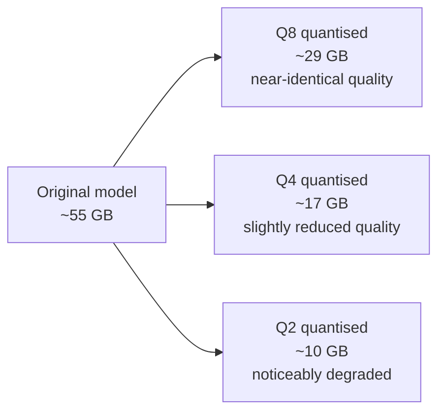
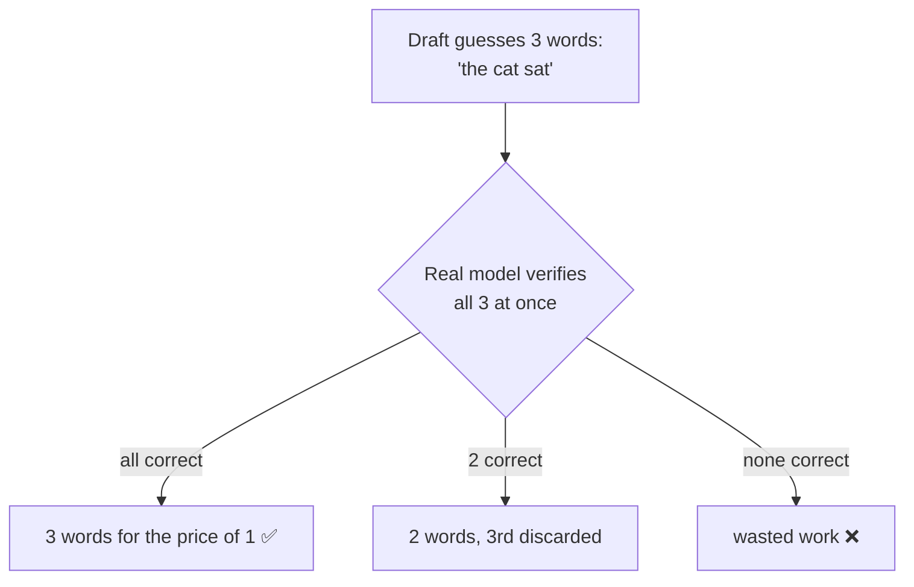

# Start here — what any of this means

You do not need to know GPU architecture to use this repo. This page explains the ideas the other
documents assume, in plain language, with the numbers measured on this actual machine.

If you read nothing else, read **§1 and §7**.

---

## 1. The two speeds that matter (they are completely different)

Every request to a language model has two phases, and they behave nothing alike.

- **Prefill** — the model reads your prompt. It can process many words at once, so this is *parallel*
  work limited by raw compute. **Measured here: ~167 tokens/sec.**
- **Generation** — the model writes the reply. Each word depends on the previous one, so it cannot
  be parallelised. It is limited by how fast weights can be pulled from memory.
  **Measured here: ~20 tokens/sec.**

A "token" is roughly ¾ of a word.

**Why you care:** if you paste a 44,000-token document, you wait **~4.5 minutes before the first
word appears** — that is prefill — and then the answer streams at about 20 tokens/sec. People
report this as "the model is slow to start", and no amount of generation tuning fixes it.

---

## 2. Why this machine is fast at some things and slow at others

This box (AMD Ryzen AI MAX+ 395, "Strix Halo") has **128 GB of memory shared between CPU and GPU**.
That is unusual and it is the whole point: a normal gaming GPU has 8–24 GB, so a large model simply
will not fit. Here it does.

The trade-off:

| | this box | a big discrete GPU |
|---|---|---|
| memory capacity | **128 GB** — huge models fit | 8–24 GB — many models do not fit |
| memory *speed* | ~256 GB/s | up to ~1000 GB/s |

So: **capacity is the strength, bandwidth is the weakness.** Generation speed is set almost entirely
by memory bandwidth, which is why a 27-billion-parameter model generates at ~20 tokens/sec here
rather than the ~60+ a discrete card would give.

---

## 3. Quantisation — making the model smaller

Model weights are numbers. Storing each at full precision is wasteful, so we **quantise**: store
them at lower precision. `Q4` means roughly 4 bits per weight instead of 16.

**The obvious conclusion is wrong here.** You would expect a smaller model to be faster, since there
are fewer bytes to read. We measured it:

| quant | size | speed |
|---|---:|---:|
| **Q4_K_XL** | 16.69 GB | **20.06 t/s** |
| IQ4_XS | 14.63 GB | 19.63 t/s |
| Q3_K_XL | 12.52 GB | 18.17 t/s |

Smaller is *slower*. Unpacking the more aggressively-compressed formats costs more arithmetic than
the bandwidth it saves. **Practical rule: use `Q4_K_XL`. Do not download smaller quants hoping for
speed.**

---

## 4. Context and the KV cache — the model's short-term memory

**Context** is how much the model can "have in mind" at once — this one holds 262,144 tokens
(roughly a 600-page book). As it reads, it builds a **KV cache**: notes about everything so far, so
it does not re-read from scratch for every new word.

That cache lives in memory and grows with conversation length. On most models it is enormous.
This model is unusual — only 16 of its 64 layers keep a cache (the rest use a cheaper mechanism) —
so a full 262,144-token context costs about 16 GB, and **using the full context slows generation by
only ~3%**. On a conventional model of this size it would cost far more.

**`q8_0` KV cache** halves that memory for free — measured at 20.23 t/s versus 20.06 uncompressed,
i.e. no loss at all. Going further (`q4_0`) costs 5% and is not worth it.

---

## 5. Speculative decoding — the single biggest speed win

Generation is slow because words come one at a time. **Speculative decoding** cheats: a fast
mechanism guesses the next few words, and the real model checks them all in one pass. Correct
guesses are free; wrong ones are discarded.

This model has the guessing mechanism built in (`MTP`), so it costs nothing extra to enable.
Measured: **11.33 → 20.27 tokens/sec, a 1.79× speedup.**

**But depth is not "more is better":**

| guess depth | speed |
|---|---:|
| off | 11.33 |
| 1 | 17.18 |
| 2 | 19.11 |
| **3** | **20.27** ⟵ best |
| 4 | 16.53 |
| 5 | **7.73** ⟵ worse than off! |

Guess too far ahead and most guesses are wrong; verifying them costs more than they save. **Use
depth 3.**

---

## 6. Batch size — the setting almost everyone gets wrong

`--ubatch-size` controls how many tokens are processed together during prefill. Intuition says
bigger batches are more efficient. Measured, on this model:

| `--ubatch-size` | prefill speed |
|---:|---:|
| 2048 | 107.8 t/s |
| 1024 | 129.5 t/s |
| 512 (default) | 159.0 t/s |
| **256** | **167.4 t/s** ⟵ best |
| 128 | 169.0 t/s |

Smaller is better, up to a point. **`--ubatch-size 256` is 29% faster than 1024** — which is what
this repo previously recommended, based on a measurement taken on a *different kind of model*.
That is the recurring lesson: settings do not transfer between model architectures.

---

## 7. The one habit worth copying

Nearly every "obvious" optimisation tested here turned out to be wrong:

| the idea | why it sounded right | what measurement said |
|---|---|---|
| Rewrite a slow GPU kernel | the code really was inefficient | it was **under 1%** of total time |
| Use a smaller quant | fewer bytes to read | **slower** |
| Bigger batches | fewer, larger operations | **29% slower** |
| Deeper speculation | more words per pass | **worse than off** |
| Lower "reasoning effort" | less thinking = faster | **74% slower** |

Every one was a sound inference from real evidence. Every one took a single measurement to
disprove — and one of them would have cost weeks of work.

**So: measure before you optimise, and measure the thing you are about to change.** The tools here
(`scripts\windows\bench-*.ps1`, and `test-backend-ops perf` in llama.cpp) exist so that costs
minutes rather than days.

---

## 8. Glossary

| term | plain meaning |
|---|---|
| **token** | ~¾ of a word; the unit models actually process |
| **t/s** | tokens per second — the speed number |
| **prefill** | reading your prompt (parallel, compute-limited) |
| **generation** / **tg** | writing the reply (sequential, bandwidth-limited) |
| **quantisation** / **quant** | storing weights at lower precision to shrink the model |
| **context** | how much text the model can hold in mind at once |
| **KV cache** | its working notes about the conversation so far |
| **speculative decoding** | guess several words ahead, verify in one pass |
| **MTP** | this model's built-in guessing mechanism |
| **dense model** | uses all its weights for every token — steady but bandwidth-hungry |
| **MoE** | uses only a fraction of weights per token — faster, bigger on disk |
| **Vulkan** | the GPU programming interface llama.cpp uses on this AMD hardware |
| **slot** | one concurrent conversation the server can hold |
| **`-ngl`** | how many layers to put on the GPU (99 = all of them) |

---

## Where to go next

| you want to… | read |
|---|---|
| make it faster | [BENCHMARKS.md](BENCHMARKS.md) — the measured settings, ready to copy |
| understand every avenue tried | [GOING-FASTER.md](GOING-FASTER.md) — including the dead ends |
| choose a model or quant | [OPTIMIZATION.md](OPTIMIZATION.md) |
| serve real users | [MULTI-USER.md](MULTI-USER.md) |
