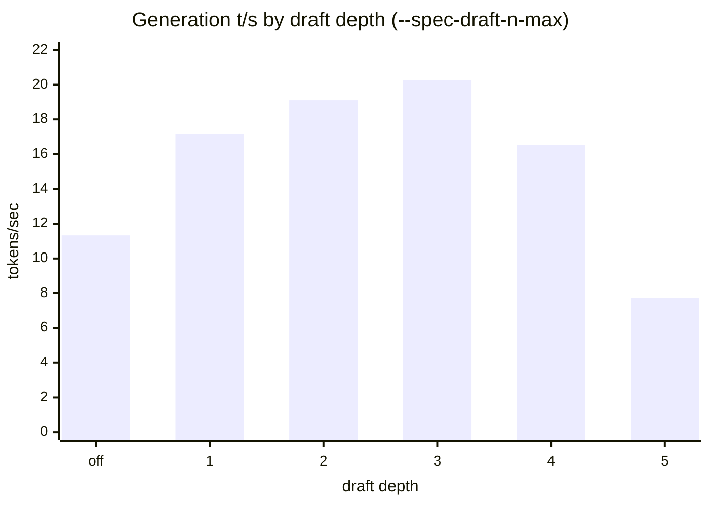
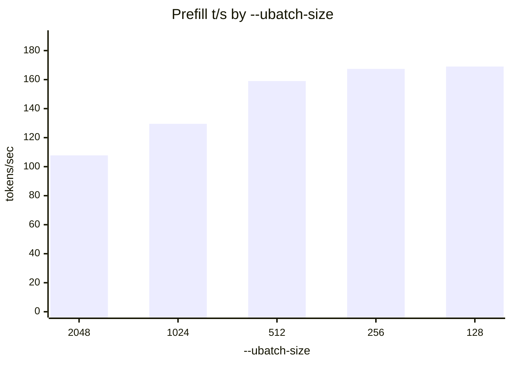
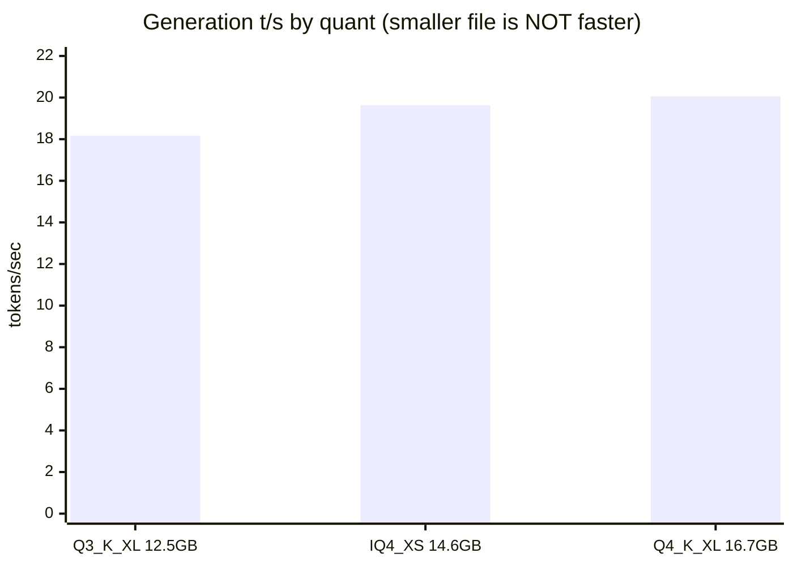

# Results

Everything measured on one machine: **AMD Ryzen AI MAX+ 395 "Strix Halo"**, Radeon 8060S,
128 GB unified memory (32/96 split), Windows, llama.cpp **b10431**, Vulkan.

New to this? **[EXPLAIN.md](EXPLAIN.md)** defines every term used here.

> **MEASURED** = ran on this box. Nothing on this page is a vendor claim or an estimate unless it
> says so.

---

## 1. The short version

| question | answer |
|---|---|
| Which model? | **Qwen3.8-27B UD-Q4_K_XL** — 100% on tool calling, 16.7 GB |
| How fast does it write? | **20.3 t/s** (~38 t/s on code, where speculation lands better) |
| How fast does it read? | **167 t/s** — a 44k-token prompt takes ~4.5 min before the first word |
| Biggest single win | speculative decoding, **+79%** |
| Most-often-wrong setting | `--ubatch-size` — the common value costs **29%** |

Copy-paste config:

```
--model Qwen3.8-27B-UD-Q4_K_XL.gguf -ngl 99 -fa on
--spec-type draft-mtp --spec-draft-n-max 3
-b 2048 -ub 256
-ctk q8_0 -ctv q8_0
-c 262144
```

---

## 2. Speed

### Generation — speculative decoding is the whole game



Depth **3** is the peak at **20.27 t/s**, 1.79x the unaccelerated 11.33. Depth **5 is worse than
switching speculation off entirely** — each rejected draft token costs a full verify pass that
produces nothing.

### Prefill — smaller ubatch is faster, against all intuition



**`-ub 256` is +29% over `-ub 1024`.** `-b` makes no measurable difference at matched `-ub`.
A separate re-run of the 512 case landed within 0.1% (159.02 vs 159.16), so this is the flag and
not drift.

### Quantisation — bigger is faster here



Unpacking the more compressed formats costs more arithmetic than the bandwidth it saves.
**Use `Q4_K_XL`.**

### Everything else

| change | result |
|---|---|
| `-ctk/-ctv q8_0` | **20.23 t/s — free**, and halves the KV cache |
| `-ctk/-ctv q4_0` | 18.99 — 5% worse, no reason to go below q8_0 |
| `-fa off` | 17.62 — keep flash attention on |
| `-c 262144` (full context) | 19.67 — full context costs only **3%** |
| `draft-mtp,ngram-mod` stacked | 17.97 — stacking speculators loses |

### `reasoning_effort` — the default is already best

| task | `low` | `medium` | **`xhigh`** (default) |
|---|---|---|---|
| easy | 19 tok / 2.9 s | 30 / 3.3 s | 27 / 4.0 s |
| mid | 249 / 11.7 s | 234 / 10.8 s | **158 / 8.9 s** |
| hard | 1132 / 46.7 s | 1370 / 55.8 s | **577 / 26.9 s** |

Setting `low` to "save time" makes hard requests **74% slower**. The setting swaps instruction
text rather than capping a budget, and it controls *answer* length more than thinking length.
n=1 per cell; quality not assessed.

---

## 3. Quality

Scored against two **private** suites that exist nowhere public, so no model has trained on them.
The harness is in this repo; the answers are not. See [BENCHMARKS.md](BENCHMARKS.md).

### Tool calling — 29 cases

| model | score | 95% CI |
|---|---|---|
| **Qwen3.8-27B Q4_K_XL** | **29/29 = 100%** | [88.3, 100.0] |
| Ornith-1.0-35B Q5_K_M | 28/29 = 96.6% | [82.8, 99.4] |
| Qwen3.5-122B-A10B Q4_K_XL | 28/29 = 96.6% | [82.8, 99.4] |
| Laguna-S-2.1 Q4_K_M | 27/29 = 93.1% | [78.0, 98.1] |

⚠️ **This is not a ranking.** The gap to second place is one case out of 29 and the confidence
intervals overlap almost entirely. What it supports: Qwen3.8 is **not worse** than the others, and
a 27B model matches a 125B one here at a quarter of the size.

Qwen3.8 breakdown: selection 5/5, arguments 8/8, multi-step 3/3, chaining 2/2, enums 3/3,
**abstention 5/5**, hard cases 3/3. Abstention is where models usually leak points by calling a
tool when they should decline.

### Agentic coding — 70 hidden tests, multi-turn

🔄 **Re-running for all models on identical infrastructure (b10431, sandbox image rebuilt
2026-08-15).** The previous three-model table was produced on an older llama.cpp and an older
container; the harness code itself is unchanged.

Qwen3.8-27B Q4_K_XL, in progress:

| task | turn 1 | turn 2 | turn 3 |
|---|---|---|---|
| token_budget | 12/12 | 20/20 | 20/20 |
| shard_planner | 8/8 | — | — |
| window_merge | — | — | — |
| quant_pick | — | — | — |

Prior results (2026-08-04, older build): all three of Ornith, Qwen3.5-122B and Laguna scored
**70/70** with zero regressions and 45/45 on turn 1 — a three-way tie.

---

## 4. Where the time goes

Per-op profile of a real prefill (`GGML_VK_PERF_LOGGER`), one ubatch:

| operation | share |
|---|---:|
| **MUL_MAT** (weight matmuls) | **~93%** |
| CONCAT | 1.7% |
| GATED_DELTA_NET | 1.1% |
| GLU | 1.0% |
| everything else | ~3% |

A 27.8B dense model needs ~2.45 PFLOP for a 44k prompt, and `MUL_MAT` on q4_K measures
**10.83 TFLOPS** — close to what this hardware can do. **Roughly half of prefill is irreducible
arithmetic.** No flag, fork or kernel changes that.

Three kernel-level optimisations were investigated and all three closed:

| candidate | measurement | verdict |
|---|---|---|
| chunked Gated DeltaNet port | 1.1% of prefill | not worth touching |
| weight matmul | 10.83 TFLOPS | near ceiling |
| flash attention | flat 6.3–7.1 TFLOPS, kv 4k→32k | no defect |

See [GOING-FASTER.md](GOING-FASTER.md) for the full reasoning.

---

## 5. Reproducing any of this

```powershell
scripts\windows\bench-qwen38.ps1           # speculative depth, KV quant, context, concurrency
scripts\windows\bench-qwen38-opt.ps1       # prefill batch, quant, flags, reasoning_effort
scripts\windows\bench-qwen38-ubatch.ps1    # ubatch below 512
evals\run-model-suite.ps1 -Label <x> -Model <path>   # both quality suites
```

Every one refuses to start if another server holds the GPU — two resident models share one memory
bus, and a contended number is not a wrong number, it is a meaningless one.
