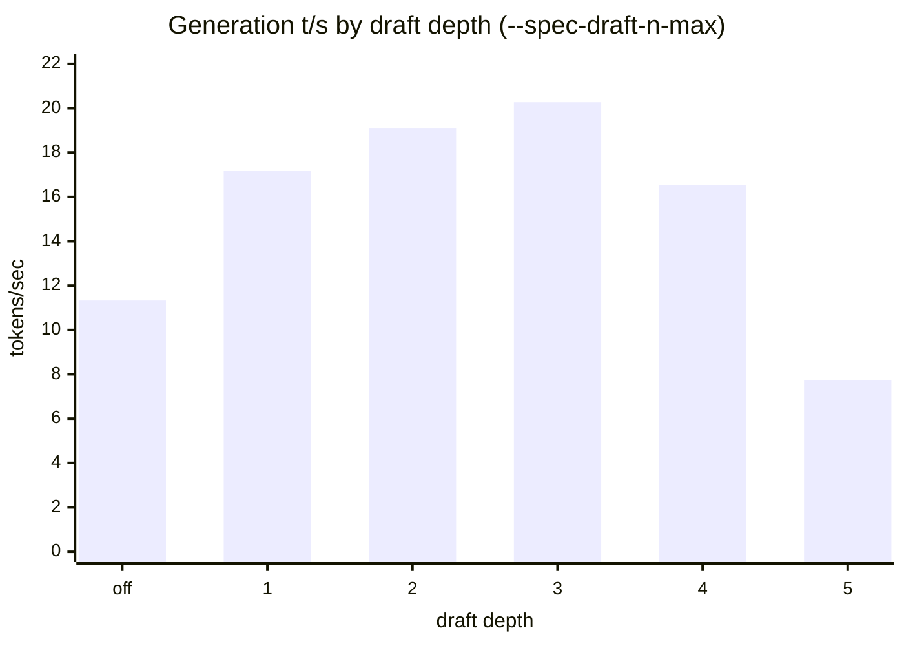
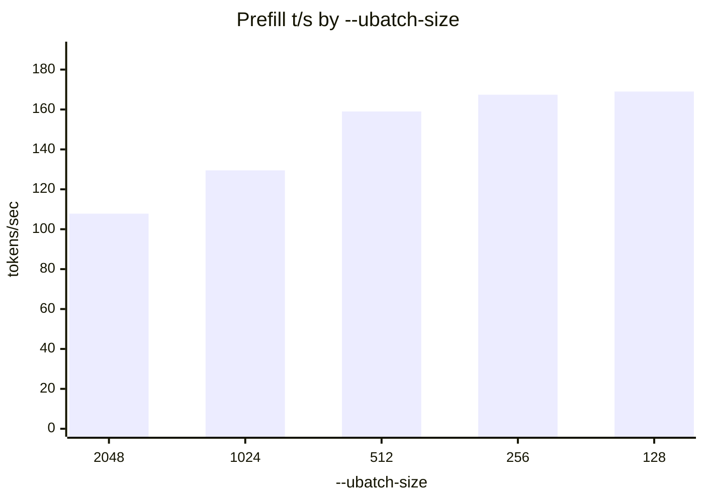
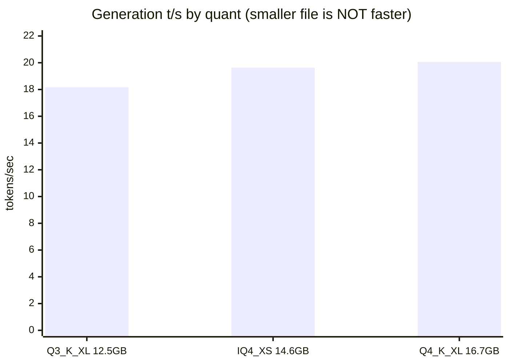

# Results

Everything measured on one machine: **AMD Ryzen AI MAX+ 395 "Strix Halo"**, Radeon 8060S,
128 GB unified memory (32/96 split), Windows, llama.cpp **b10431**, Vulkan.

New to this? **[EXPLAIN.md](EXPLAIN.md)** defines every term used here.

> **MEASURED** = ran on this box. Nothing on this page is a vendor claim or an estimate unless it
> says so.

---

## 1. The short version

| question | answer |
|---|---|
| Which model? | **Qwen3.8-27B UD-Q4_K_XL** on speed and size — 16.7 GB, the smallest of the five benchmarked. Quality ranking is [being re-measured](#3-quality) |
| How fast does it write? | **20.3 t/s** (~38 t/s on code, where speculation lands better) |
| How fast does it read? | **167 t/s** — a 44k-token prompt takes ~4.5 min before the first word |
| Biggest single win | speculative decoding, **+79%** |
| Most-often-wrong setting | `--ubatch-size` — the common value costs **29%** |
| Biggest *mistake* here | trusting a benchmark everyone passed. [What that hid →](#3-quality) |

Copy-paste config:

```
--model Qwen3.8-27B-UD-Q4_K_XL.gguf -ngl 99 -fa on
--spec-type draft-mtp --spec-draft-n-max 3
-b 2048 -ub 256
-ctk q8_0 -ctv q8_0
-c 262144
```

---

## 2. Speed

### Generation — speculative decoding is the whole game



Depth **3** is the peak at **20.27 t/s**, 1.79x the unaccelerated 11.33. Depth **5 is worse than
switching speculation off entirely** — each rejected draft token costs a full verify pass that
produces nothing.

### Prefill — smaller ubatch is faster, against all intuition



**`-ub 256` is +29% over `-ub 1024`.** `-b` makes no measurable difference at matched `-ub`.
A separate re-run of the 512 case landed within 0.1% (159.02 vs 159.16), so this is the flag and
not drift.

**Note that 128, not 256, is the tallest bar** — by 0.9%, on one run each. The honest reading is
that the curve goes flat below 256 (everything from 256 down sits between 167.4 and 169.0) while
the 512→256 step is worth 5%. `-ub 256` is shipped as the knee of that curve, not as the maximum.
See [BENCHMARKS.md](BENCHMARKS.md#round-2-2026-08-14-b10431-the-flags-that-actually-matter) for the
full table.

### Quantisation — bigger is faster here



Unpacking the more compressed formats costs more arithmetic than the bandwidth it saves.
**Use `Q4_K_XL`.**

### Everything else

| change | result |
|---|---|
| `-ctk/-ctv q8_0` | **20.23 t/s — free**, and halves the KV cache |
| `-ctk/-ctv q4_0` | 18.99 — 5% worse, no reason to go below q8_0 |
| `-fa off` | 17.62 — keep flash attention on |
| `-c 262144` (full context) | 19.67 — full context costs only **3%** |
| `draft-mtp,ngram-mod` stacked | 17.97 — stacking speculators loses |

### `reasoning_effort` — the default is already best

| task | `low` | `medium` | **`xhigh`** (default) |
|---|---|---|---|
| easy | 19 tok / 2.9 s | 30 / 3.3 s | 27 / 4.0 s |
| mid | 249 / 11.7 s | 234 / 10.8 s | **158 / 8.9 s** |
| hard | 1132 / 46.7 s | 1370 / 55.8 s | **577 / 26.9 s** |

Setting `low` to "save time" makes hard requests **74% slower**. The setting swaps instruction
text rather than capping a budget, and it controls *answer* length more than thinking length.
n=1 per cell; quality not assessed.

---

## 3. Quality

Scored against two **private** suites that exist nowhere public, so no model has trained on them.
The harness is in this repo; the answers are not. See [BENCHMARKS.md](BENCHMARKS.md).

> ## ⚠️ The published quality scores are withdrawn
>
> Every quality number produced before 2026-08-15 was measured under **greedy decoding**
> (temperature 0), and the scorer was **discarding truncated turns**. Together those two choices
> manufactured a tie. Do not quote the old table. The speed numbers above are unaffected — they
> never depended on the sampler.

### What went wrong

Temperature 0 was chosen for reproducibility: same input, same output, no sampling noise between
models. For thinking models it is measurably the wrong choice.

An audit of the retained transcripts found that **every truncated turn was a repetition loop that
emitted no answer at all — 9 of 9, across all four models:**

| model | task | | |
|---|---|---|---|
| Laguna-S-2.1 | window_merge t3 | 439× repeat, 166 KB | no answer |
| Qwen3.5-122B | quant_pick t2 | 160× repeat, 54 KB | no answer |
| Ornith-1.0-35B | hard_ratelimit t3 | 134× repeat, 175 KB | no answer |

Qwen ships the warning on its own model cards: *"We do NOT recommend using greedy decoding, as it
can lead to performance degradation and endless repetitions."*

It stayed hidden because the scorer **excluded truncated turns** — a rule meant to stop a harness
token limit being scored as a coding failure. It was treating the symptom in the wrong layer: it
silently rescued the turns where the model produced nothing. That is precisely why four models
spanning 16.7 GB to 89 GB appeared to tie.

Re-scoring those same transcripts *without* the rescue shows how much it was covering:

| model | task | raw last turn | was reported |
|---|---|---|---|
| Qwen3.5-122B | token_budget | **0/20** | 70/70 |
| Qwen3.5-122B | window_merge | **0/18** | 70/70 |
| Qwen3.8-27B | window_merge | **3/18** | 70/70 |
| Laguna-S-2.1 | window_merge | **no code emitted** | 70/70 |
| Ornith-1.0-35B | quant_pick | 15/18 | 70/70 |

### What changed

| | |
|---|---|
| **sampler** | temperature 0.3, with temp and seed written into every result row — runs under different samplers can never be silently compared again |
| **strict column** | every task reports its score twice: rescued, and with no rescue at all. If they agree the rule did nothing; if they diverge, that *is* the finding |
| **tiers scored apart** | a saturated tier can no longer flatter a model through a combined percentage |
| **one generation, not two** | `max_tokens` 32768 up front instead of 16384-then-retry. At fixed seed the retry re-derived the same prefix, so it only ever bought room — and cost ~16 min/turn |
| **a hard tier** | 3 new multi-turn tasks, 89 hidden tests |

Every reference solution is verified to pass **100% of its own hidden tests at every turn** before a
run starts (159 tests across 7 tasks), and the changed scoring path is unit-tested against a turn
truncated *after* completing its work and one truncated *while losing* it.

### The hard tier

Four turns each, and the hidden tests probe what the spec *implies* rather than what it states:

| task | what it actually tests |
|---|---|
| `hard_ratelimit` | a token bucket with fractional refill, atomic multi-key acquire, and monotonic time under clock skew |
| `hard_semver` | semver 2.0.0 precedence, `^`/`~` range semantics, and prerelease exclusion from ranges |
| `hard_where` | a SQL `WHERE` evaluator in full three-valued logic — `FALSE AND NULL` is FALSE, `NULL = NULL` is NULL, `x NOT IN (7, NULL)` is never TRUE |

**It discriminates** — but the first headline number off it was wrong, in the suite's now-familiar
way. Ornith-1.0-35B, which scores 70/70 on the easy tier, was reported at **16/89 (18%)**:

| task | turn 1 | as reported | corrected |
|---|---|---|---|
| hard_ratelimit | 10/10 | 16/25 | 16/25 |
| hard_semver | 11/11 | ~~0/27~~ | **11/27** |
| hard_where | 14/14 | ~~0/37~~ | **22/37** |
| **total** | | ~~16/89 (18%)~~ | **49/89 (55%)** |

> 🚩 **Bug 12, caught 2026-08-15.** The turn prompts say *"Add a `Range` class"*, so models replied
> with only the new code. The harness overwrites `solution.py` wholesale, so a partial reply loses
> the earlier turns and fails on import. That was anticipated and flagged `FRAGMENT` — but the check
> tested `entry not in code`, a **substring** match, and a fragment that merely *calls* the entry
> symbol contains the string. Five turns were graded as complete solutions scoring 0.
> [`../evals/README.md`](../evals/README.md) has the write-up; `evals/rescore.py` re-derives scores
> from stored runs without spending GPU time.

**The real finding is narrower and more interesting than "it collapses."** Ornith passes *every*
first-turn test on all three tasks and demonstrably gets substantial work passing on later turns —
then loses it at the handoff by replying with a diff instead of a file. That is a failure worth
measuring. It is not the same claim as "it cannot write the code," which is what 18% implied.

A caveat on the corrected number too: **nothing in the protocol tells the model to return the
complete file** — there is no system prompt, and no turn prompt says it. The harness requires it
anyway. Until that is stated explicitly, some of what is left is still measuring an unstated
requirement rather than coding ability.

### 🔄 Current status

The full re-run across all five models is **in progress** (speed → hard tier → easy tier + tools).
Until it completes there is no defensible quality ranking here, and this page will not print one.

**Pick on speed and size in the meantime** — §2 above is unaffected.

---

## 4. Where the time goes

Per-op profile of a real prefill (`GGML_VK_PERF_LOGGER`), one ubatch:

| operation | share |
|---|---:|
| **MUL_MAT** (weight matmuls) | **~93%** |
| CONCAT | 1.7% |
| GATED_DELTA_NET | 1.1% |
| GLU | 1.0% |
| everything else | ~3% |

A 27.8B dense model needs ~2.45 PFLOP for a 44k prompt, and `MUL_MAT` on q4_K measures
**10.83 TFLOPS** — close to what this hardware can do. **Roughly half of prefill is irreducible
arithmetic.** No flag, fork or kernel changes that.

Three kernel-level optimisations were investigated and all three closed:

| candidate | measurement | verdict |
|---|---|---|
| chunked Gated DeltaNet port | 1.1% of prefill | not worth touching |
| weight matmul | 10.83 TFLOPS | near ceiling |
| flash attention | flat 6.3–7.1 TFLOPS, kv 4k→32k | no defect |

See [GOING-FASTER.md](GOING-FASTER.md) for the full reasoning.

---

## 5. Reproducing any of this

Start from [INSTALL.md](INSTALL.md) if you don't have a working endpoint yet — Windows, Linux and
macOS are all covered there.

```powershell
scripts\windows\bench-qwen38.ps1           # speculative depth, KV quant, context, concurrency
scripts\windows\bench-qwen38-opt.ps1       # prefill batch, quant, flags, reasoning_effort
scripts\windows\bench-qwen38-ubatch.ps1    # ubatch below 512

evals\run-full-bench.ps1                   # the whole stack: speed, hard tier, easy tier + tools
evals\run-model-suite.ps1 -Label <x> -Model <path>   # one model, both quality suites
python evals\summarize-bench.py            # turn a completed run into the published table
```

Every one refuses to start if another server holds the GPU — two resident models share one memory
bus, and a contended number is not a wrong number, it is a meaningless one.
